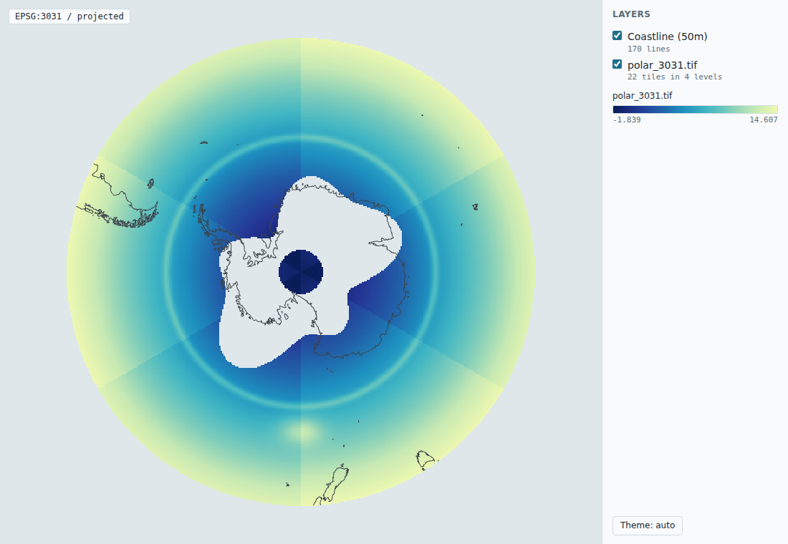
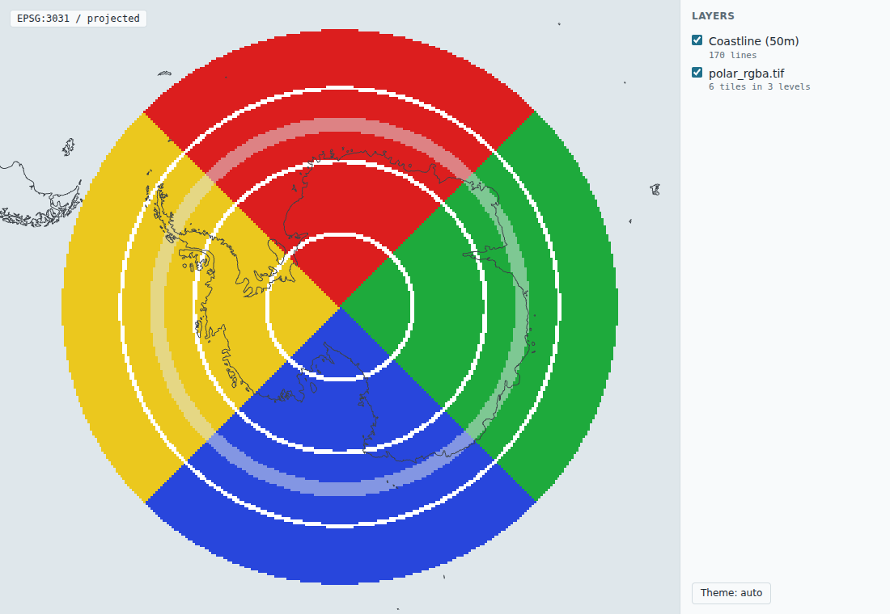
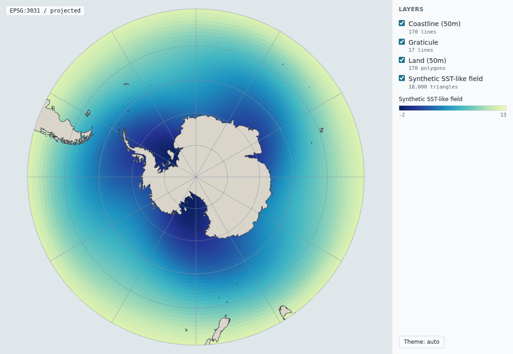

# aobcore

Lean R core for allonboard: producers to native GeoArrow and grid descriptors, scene building, embed transport, and the bundled renderer. Core Imports stay at nanoarrow, geoarrow, wk and htmltools. The package name is a placeholder.

Read the org agent brief first: [allboa/design AGENTS.md](https://github.com/allboa/design/blob/main/AGENTS.md). It covers the design principles, how work flows, and when to stop and ask.

## Status

Early (phase 1), following [scene spec 0.1, 0.2 and 0.3](https://github.com/allboa/scenespec). Nothing here is on CRAN.

- `scene()` starts a scene in a projected view CRS (EPSG:3031 by default).
- `vector_stream(x, crs)` turns any wk-handleable input (sf, sfc, wk vectors, data frames with a geometry column, or a WKB Arrow stream) into a nanoarrow stream with a native, interleaved GeoArrow geometry column. The core does not reproject: coordinates must already be in the view CRS.
- `gdal_vector_stream(dsn, crs, ...)` reads, clips, densifies and reprojects any GDAL vector source to native GeoArrow (gdalraster, in Suggests; decision 0002). It uses GDAL's Arrow driver when present (`gdal_has_arrow()`), otherwise converts in R.
- `vector_ipc()` writes Arrow IPC bytes; `scene_add_data()`, `scene_add_layer()` and `scene_add_vector()` add data references and layers; `scene_blobs()` returns the bytes; `scene_json()` writes the scene document.
- `write_scene_html(scene)` writes a self-contained page that draws the scene (the embed transport); `probe_scene()` is the polar probe conformance scene with its data.
- Tiled COGs, R-planned (gate A, design decision 0003): `cog_info()` reads a COG's levels and tile byte ranges through GDAL, `cog_plan()` plans tiles and projected meshes for a view CRS, `scene_add_tiled_raster()` adds a scene spec 0.2 `tiled_raster` layer (0.3 for a colour image or JPEG tiles), and `view_cog()` does it all and writes the page in one call (gdalraster, in Suggests).

```r
library(aobcore)
coast <- system.file("extdata", "coastline_south_40s.geojson", package = "aobcore")
s <- scene("EPSG:3031")
s <- scene_add_vector(s, "coast", gdal_vector_stream(coast, s$view$crs, densify = 0.25),
                      stroke = c(60, 66, 72, 255), stroke_width_px = 1)
cat(scene_json(s, pretty = TRUE))
write_scene_html(s, file = "coast.html")
```

## A COG in its own view, in one call

```r
library(aobcore)
f <- view_cog(system.file("extdata", "polar_3031.tif", package = "aobcore"), crs = "EPSG:3031",
              palette = "ocean")
browseURL(f)
```

`view_cog()` is `cog_info()`, `cog_plan()`, `scene_add_tiled_raster()` (plus the bundled coastline) and `write_scene_html()`; `cog_scene()` stops before writing the page. R plans every level up front (`coverage = "all_levels"`), and the renderer picks the level for the zoom with the plan's selection rule, keeps the tiles whose footprint meets the viewport, and draws each tile's mesh with its decoded bytes as texture. `cog_plan(..., extent, units_per_pixel)` makes a plan for one view instead.

How it works, following [decision 0003](https://github.com/allboa/design/blob/main/decisions/0003-tiled-cog-polar.md):

- **Structure from GDAL.** Each level (the full-resolution image and each overview) is opened as its own GDAL dataset, so its geotransform and extent are GDAL's own, never the base grid scaled by a decimation factor. Tile byte ranges are the `BLOCK_OFFSET_<col>_<row>` and `BLOCK_SIZE_<col>_<row>` items in GDAL's `TIFF` metadata domain; codec and predictor come from `IMAGE_STRUCTURE`.
- **Meshes.** Each tile gets a lattice over its valid pixels, projected to the view CRS with GDAL/PROJ and refined until the triangles are within a quarter of a source pixel of the exact projection (all tiles of a level share one lattice size, so edges match). A tile already in the view CRS is two triangles. All meshes go in one Arrow vertex table (`position`, `uv` as `FixedSizeList<float32, 2>`) and one index table (`uint32`), with per-tile row runs; UVs are in tile space.
- **Decoding in the browser.** Codecs `none`, `deflate` (fflate), `zstd` (fzstd), `lzw` and `packbits` (the geotiff.js decoders), predictors `horizontal` and `floating_point`, every spec dtype in either byte order, interleaved and band-separate tiles, `scale`/`offset`, `nodata` and the palette. `lerc`, `lerc_deflate`, `lerc_zstd` and `webp` are not supported: such a layer is reported as an error in the page's status line and not drawn; the rest of the scene draws.
- **Colour images and JPEG (scene spec 0.3).** A COG with 3 or 4 Byte bands whose colour interpretation is Red, Green, Blue (and Alpha), such as a rendered chart or aerial imagery, is drawn as a colour image by default (`rgb`); `band =`, `palette =` or `rgb = FALSE` draw one band through a palette, and `rgb = c(r, g, b[, a])` picks bands. Alpha 0, or all three colour bands at `nodata`, is transparent. JPEG COGs are carried with each level's shared JPEGTables, which `cog_info()` reads from the TIFF's image directories (with each level's photometric interpretation); the renderer joins the tables to each tile and decodes it with the browser's own JPEG decoder. Only YCbCr (GDAL's default for RGB) and greyscale JPEG are allowed; others are refused in R, per layer. A JPEG COG's internal mask is not carried.
- **Version.** Scenes are written at the lowest spec version that expresses them: 0.2 for palette COGs, 0.3 only when a layer uses `rgb` or JPEG tiles.
- **Transport.** A COG given by URL is read by the browser with HTTP range requests (the server must allow range requests and CORS). A page opened from `file://` cannot range-request a local file, so for a local COG the bytes of every planned tile are embedded in the page as blobs keyed `"<source id>@<byte_offset>+<byte_length>"` (`embed = TRUE`, the default for local files). The renderer uses such a blob when it has one and fetches the range otherwise; the scene's `cog` reference still names the source file as a `file://` URL. This needs no new Imports and no server, at the cost of a page as large as the planned tiles.





## A self-contained page

`write_scene_html(scene, blobs = scene_blobs(scene), file)` writes one HTML file: the scene as JSON (`scene_json()`), each Arrow IPC blob as base64, and the bundled renderer inlined, so the page works offline and loads nothing from a CDN. A scene built with `scene_add_*()` carries its blobs; a plain list following scene spec 0.1 can be given with a named list of raw blobs instead.

```r
library(aobcore)
f <- write_scene_html(probe_scene(), file = "polar-probe.html")
browseURL(f)
```

The page follows the browser's light or dark preference; `theme = "light"` or `"dark"` fixes it, and the page has a theme button.



## The renderer

The renderer implements scene spec 0.1, 0.2 and 0.3 on [deck.gl](https://deck.gl) and [apache-arrow](https://arrow.apache.org/docs/js/). Its source is in `js/src/` and is not part of the R package; the package ships one minified bundle, `inst/renderer/aob-renderer.min.js` (about 1.2 MiB), and `inst/COPYRIGHTS` for the bundled code. Everything that maps spec concepts to deck.gl is in `js/src/layers.js` and, for tiled rasters, `js/src/tiles.js`; tile decoding is in `js/src/decode.js`, and JPEG tiles go through the browser's decoder in `js/src/jpeg.js`.

What it draws: `polygon` (fill with holes, optional stroke), `path`, `point` (fill and stroke, `radius_px`), and their multi- encodings; colors as constant RGBA or an RGBA column; `raster` as values on a grid descriptor colored by a named palette (`ocean`, `viridis`, `ice`, `gray`; any other name is an error for that layer, which is then not drawn and is reported in the page's status line), on a pre-projected mesh, or without a mesh when the grid is in the view CRS; `nodata`, NaN and Arrow nulls are transparent. `projected` and `cartesian` views are flat views of view CRS units; `globe` is drawn for vector layers only. Data marked `origin_subtracted` are placed back at `view.local_origin`, and raster meshes are drawn relative to it. `tiled_raster` (0.2, and 0.3 colour images and JPEG tiles) is drawn as described above. Data references with a `url` are fetched, and tiles of a `cog` by URL are fetched by range. Those fetches are the page's only network requests: the renderer, the scene and blobs are inline, and loaders.gl (bundled as a deck.gl dependency) could only reach the network to load a worker or an image by URL, which this renderer never asks it to do.

### Rebuild the bundle

The bundle is reproducible from `js/package.json` and `js/package-lock.json` with Node 22:

```sh
cd js
npm ci
npm run build          # writes inst/renderer/aob-renderer.min.js and inst/COPYRIGHTS
npm run check-bundle   # fails if the committed files differ from a fresh build
npm test               # renderer tests; the page test needs Chromium (CHROMIUM_PATH=...)
```

The build fails if the bundle has non-ASCII characters or a closing script tag. CI runs `check-bundle` and `npm test` on every pull request (`.github/workflows/renderer-bundle.yaml`).

### Screenshots

`tools/write-scenes.R` writes the conformance scene, a scene of every 0.1 layer kind, the polar COG fixtures as 0.2 tiled rasters, and the RGBA and YCbCr JPEG colour COG fixtures as 0.3 colour images (whole, and zoomed in on the pole) as pages and as scene JSON; `js/screenshots.mjs` takes light and dark screenshots of each page with headless Chromium into `tools/screenshots/`:

```sh
R CMD INSTALL .
Rscript tools/write-scenes.R /tmp/scenes
node scenespec/scripts/validate.js /tmp/scenes/*.json   # from allboa/scenespec
cd js && node screenshots.mjs /tmp/scenes               # CHROMIUM_PATH=... to pick a browser
```

## Install

```r
# install.packages("remotes")
remotes::install_github("allboa/aobcore")
```

Imports: nanoarrow, geoarrow, wk, htmltools. gdalraster is suggested for the GDAL vector producer and the COG planner. For GDAL to encode GeoArrow itself it needs the Arrow driver; on conda-forge that is the `libgdal-arrow-parquet` package.
